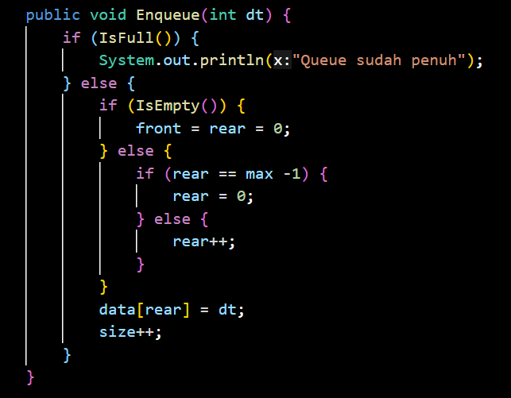

|  | Algoritma dan Struktur Data|
|--|--|
| Nama       |  Tri Desti Sasmita|
| Nim        |  244107020167|
| Kelas | TI-1H |
| Repository |[Link!] (https://github.com/Stridesti/AlgoritmaDan-StrukturData.git)|

# Jobsheet 11 Queue

## 2.1 Percobaan 1: Operasi Dasar

### 2.1.2. Verifikasi Hasil Percobaan

Queue(Run)
---
.png>)
---
.png>)
---

### 2.1.3 Pertanyaan

    1. Nilai awal atribut front dan rear pada konstruktor struktur data antrian (queue) biasanya diatur ke -1 untuk menandakan bahwa antrian masih kosong dan belum ada elemen yang dimasukkan. Dengan nilai -1, kita dapat dengan mudah memeriksa status antrian: jika front == -1 dan rear == -1, maka antrian benar-benar kosong. Sementara itu, atribut size diinisialisasi dengan nilai 0 karena pada saat objek antrian baru dibuat, belum ada elemen yang masuk ke dalam antrian, sehingga jumlah elemen (size) memang 0.

    
    2. Kode ini memeriksa apakah pointer rear sudah berada di indeks terakhir array (yaitu max - 1). Jika iya, maka rear di-set kembali ke 0, yaitu ke posisi awal array. Potongan kode tersebut digunakan pada circular queue untuk membuat pointer rear kembali ke posisi 0 saat sudah mencapai indeks terakhir array, sehingga antrian bisa memanfaatkan ruang kosong di awal array dan tidak membuang-buang memori

    3. Maksud kode ialah memeriksa Indeks Terakhir, Kode ini memeriksa apakah indeks 'front' telah mencapai indeks terakhir dari array (yaitu 'max - 1'). untuk Mengatur front Kembali ke 0: Jika front berada di indeks terakhir, maka kode ini mengatur front kembali ke 0. Ini memungkinkan antrian melingkar untuk terus beroperasi dengan menggunakan kembali ruang di awal array setelah elemen dihapus dari bagian depan.

    4. Karena variabel i harus mulai dari posisi front, supaya elemen yang dicetak sesuai urutan antrian yang sebenarnya, bukan berdasarkan dari indeks awal array.

    5. Potongan kode tersebut sering digunakan dalam struktur data antrian melingkar (circular queue) atau saat ingin melakukan iterasi berulang pada array dengan jumlah elemen tetap. i ialah sebuah variabel indeks (misal: posisi saat ini di array). max yaitu batas maksimum (biasanya panjang array atau kapasitas antrian). (i + 1) berarti indeks saat ini ditambah satu (maju satu langkah). % max adalah operasi modulus, yang akan membatasi hasilnya dari 0 sampai max-1. dan dengan menambah nilai i satu per satu. Jika i sudah mencapai max-1, maka (i + 1) % max akan kembali ke 0 Dengan kata lain, indeks akan berputar kembali ke awal jika sudah sampai ujung. Jadi maksud potongan kode i = (i + 1) % max tersebut  digunakan untuk mengiterasi indeks secara melingkar (circular), sehingga setelah mencapai indeks terakhir, akan kembali ke indeks pertama.

    
    6. Potongan kode program yang merupakan queue overflow!

        
        ---

    7. 

## 2.2. Percobaan 2: Antrian Layanan Akademik

### 2.2.2 Verifikasi Hasil Percobaan

Running
---

---

---

### 2.2.3 Pertanyaan

Lakukan modifikasi program dengan menambahkan method baru bernama LihatAkhir pada class
AntrianLayanan yang digunakan untuk mengecek antrian yang berada di posisi belakang. Tambahkan
pula daftar menu 6. Cek Antrian paling belakang pada class LayananAkademikSIAKAD sehingga
method LihatAkhir dapat dipanggil!

---

---

---

Hasil Running
---

---

## 2.3. Tugas

Ada 2 kelas yaitu: AntrianKRS & AntrianKRSMain

Hasil Running
---
.png>)
---
.png>)
---

---

---

---

---

---
.png>)
---